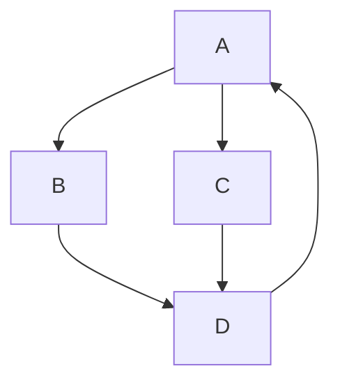

## Awesome Project

> Build on react native cli followed official app setup guide

###### Thigns I wanna try out

- [ ] [StoryBook](https://storybook.js.org/tutorials/intro-to-storybook/react-native/en/get-started/)
- [x] [EsLint](https://eslint.org/docs/latest/use/core-concepts)
- [x] [Husky](https://www.npmjs.com/package/husky)
- [x] [Commit-Lint](https://commitlint.js.org/#/)
- [ ] [Filpper: debugging](https://fbflipper.com/docs/features/react-native/)
- [ ] [Jest unit tests](https://jestjs.io/docs/tutorial-react-native)
- [ ] [Detox e2e tests](https://wix.github.io/Detox/docs/introduction/getting-started/)
- [ ] [Performance Monitoring](https://blog.sentry.io/performance-monitoring-support-for-react-native/)
- [ ] [Sentry](https://docs.sentry.io/platforms/react-native/)
- [ ] [Fastlane: deployment](https://docs.fastlane.tools/getting-started/cross-platform/react-native/)
- [ ] CI/CD: automated tests and deployment
- [ ] Solid State Management
  - even if initial setup is quite exhausting, managing the state should be easy

###### After this project is successfully completed, we'll have

- [x] strict design system
- [x] linting and code standards
- [x] consistent commits
- [x] 100% test coverage
- [x] solid and easy state management
- [x] documentation of each code
- [x] scalable code & infrastructure
- [x] theme support (dark and light)
- [x] automated testing and deployment

###### Versions

```
java
  openjdk 11.0.20 2023-07-18 LTS
  OpenJDK Runtime Env Zulu11.66+15-CA (build 11.0.20+8-LTS)
  versions > 11 can give errors

nodejs: v16
```

###### Checks before running

- [ ] android/local.properties -> check os and user-name
- [ ] adb and android studio
- [ ] cd ios && pod install && cd ..

```
the following code (in package.json) takes care of linting and formatting the code pre-commiting
  "lint-staged": {
    "src/**/*.{ts,tsx}": [
      "eslint --ext .tsx --ext .ts src/ --fix"
    ],
    "./src/**": [
      "prettier --write ."
    ]
  },
  "husky": {
    "hooks": {
      "pre-commit": "lint-staged"
    }
  }
  "commitlint": for checking the commit

```

<br>

###### warnings jo aaye

- watchman ka tha ek, uske neeche hi tha ki kaise remove karenge, vahi karke ho gaya

###### Errors jo aaye the

- [x] React Native android build failed. SDK location not found

  - android/local.properties was missing

- [x] unable to attach DB

  - ```
      for mac:
        rm -rf ~/Library/Developer/Xcode/DerivedData/
        cd ios
        pod deintegrate
        pod update
        cd ..
        yarn run ios

      for windows:
        sorry guys, you can't test on ios emulator 😂
    ```

- [x] command adb not found
  - adb install karne se fix ho gaya

<br>

---

<br>

<br>

> graph: interesting lag raha tha to daal diya taaki baad mein yaad rahe


