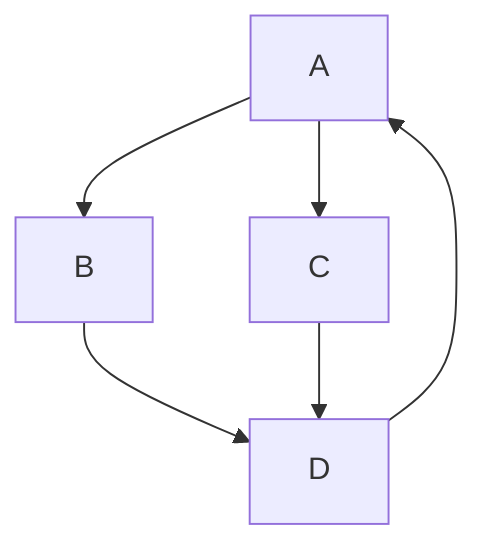

## Awesome Project

> Build on react native cli followed official app setup guide

###### Thigns I wanna try out

- [x] [EsLint](https://eslint.org/docs/latest/use/core-concepts)
- [x] [Husky](https://www.npmjs.com/package/husky)
- [x] [Commit-Lint](https://commitlint.js.org/#/)
- [ ] [Filpper: debugging](https://fbflipper.com/docs/features/react-native/)
- [ ] [Jest unit tests](https://jestjs.io/docs/tutorial-react-native)
- [ ] [Detox e2e tests](https://wix.github.io/Detox/docs/introduction/getting-started/)
- [ ] [Performance Monitoring](https://blog.sentry.io/performance-monitoring-support-for-react-native/)
- [ ] [Sentry](https://docs.sentry.io/platforms/react-native/)
- [ ] [Fastlane: deployment](https://docs.fastlane.tools/getting-started/cross-platform/react-native/)
- [ ] CI/CD: automated tests and deployment
- [ ] Solid State Management
  - even if initial setup is quite exhausting, managing the state should be easy

###### After this project is successfully completed, we'll have

- [x] linting and code standards
- [x] consistent commits
- [x] 100% test coverage
- [x] solid and easy state management
- [x] offline-support
- [x] documentation of each code
- [x] scalable code & infrastructure
- [x] theme support (dark and light)
- [x] automated testing and deployment

---

###### skipping Storybook because it may outweigh its benefits

- it can be useful when we have multiple apps that have same ui components
- [ ] [StoryBook](https://storybook.js.org/tutorials/intro-to-storybook/react-native/en/get-started/)
- [ ] strict design system with storybook

###### Versions

```
java
  openjdk 11.0.20 2023-07-18 LTS
  OpenJDK Runtime Env Zulu11.66+15-CA (build 11.0.20+8-LTS)
  versions > 11 can give errors

nodejs: v16
```

###### Checks before running

- [ ] android/local.properties -> check os and user-name
- [ ] adb and android studio
- [ ] cd ios && pod install && cd ..

```
the following code (in package.json) takes care of linting and formatting the code pre-commiting
  "lint-staged": {
    "src/**/*.{ts,tsx}": [
      "eslint --ext .tsx --ext .ts src/ --fix"
    ],
    "./src/**": [
      "prettier --write ."
    ]
  },
  "husky": {
    "hooks": {
      "pre-commit": "lint-staged"
    }
  }
  "commitlint": for checking the commit

```

<br>

###### warnings jo aaye

- watchman ka tha ek, uske neeche hi tha ki kaise remove karenge, vahi karke ho gaya

###### Errors jo aaye the

- [x] React Native android build failed. SDK location not found

  - android/local.properties was missing

- [x] unable to attach DB

  - ```
      for mac:
        rm -rf ~/Library/Developer/Xcode/DerivedData/
        cd ios
        pod deintegrate
        pod update
        cd ..
        yarn run ios

      for windows:
        sorry guys, you can't test on ios emulator 😂
    ```

- [x] command adb not found
  - adb install karne se fix ho gaya

<br>

##### Tests Setup Issues
Faced few errors while setting up the jest
```
SyntaxError: Cannot use import statement outside a module
fix: updated jest.config.js (don't know what exact fixed it, probably the babel-jest)

```
```
SyntaxError: Invalid or unexpected token
> 1 | import {createBottomTabNavigator} from '@react-navigation/bottom-tabs'

Fix
the official documentation of react-navigation, test with jest

``` 
```
Warning: `fetch` is not available. Please supply a custom `fetchFn` property to use `fetchBaseQuery` on SSR environments.

Fix 
install whatwg-fetch
after install it add import 'whatwg-fetch'; at the beginning (line 1) of the file.test youre using

``` 

```

ReferenceError: You are trying to access a property or method of the Jest environment after it has been torn down. From __tests__/App.test.tsx.
ReferenceError: You are trying to `import` a file after the Jest environment has been torn down. From __tests__/App.test.tsx.

Fix
jest.useFakeTimers(); fixed this, add this line just after the imports

```

---

<br>

###### Debugging

- [React-Devtools](https://www.npmjs.com/package/react-devtools)
- [Debugging-basics](https://reactnative.dev/docs/debugging)
- [Performance](https://sentry.io/for/performance/?utm_source=google&utm_medium=cpc&utm_id=%7B19614882438%7D&utm_campaign=Google_Search_NB_LanguageSpecific_Performance_ROW_Alpha&utm_content=g&utm_term=react%20profiling&gad=1)

###### Styling

- for resoponsive ui, use Dimensions

  ```js
  const { width, height } = Dimensions.get('window');

  container: {
    width: width < 380 ? 20 : 40,
  }
  ```

- platform specific styling

  ```js
  width: Platform.select({ios: 2, android: 0});
  ```

- platform specific files

  ```js
  colors.android.ts;
  colors.ios.ts;

  import colors from './colors';
  ```

<br>

###### CommitLint Types

```
build: Changes related to the build system or external dependencies.
Example: build: Upgrade webpack to version 5
```

```
chore: Updates or improvements to the development workflow or tools.
Example: chore: Update gitignore file
```

```
ci: Changes to the continuous integration configuration files and scripts.
Example: ci: Configure Travis CI to run tests
```

```
docs: Updates or additions to documentation.
Example: docs: Update README with new usage instructions
```

```
feat: Introduces a new feature or functionality.
Example: feat: Add user authentication feature
         feat(deps): added <package-name> <version>
```

```
fix: Fixes a bug or issue.
Example: fix: Resolve crash when submitting empty form
```

```
perf: Improves performance.
Example: perf: Optimize database query
```

```
refactor: Code refactoring without adding new features or fixing bugs.
Example: refactor: Restructure project directory
```

```
revert: Reverts a previous commit.
Example: revert: Revert changes to the user authentication
```

```
style: Changes related to code formatting, indentation, or style.
Example: style: Apply consistent indentation
```

```
test: Adds or modifies tests.
Example: test: Add unit tests for user validation

```

> graph: interesting lag raha tha to daal diya taaki baad mein yaad rahe


